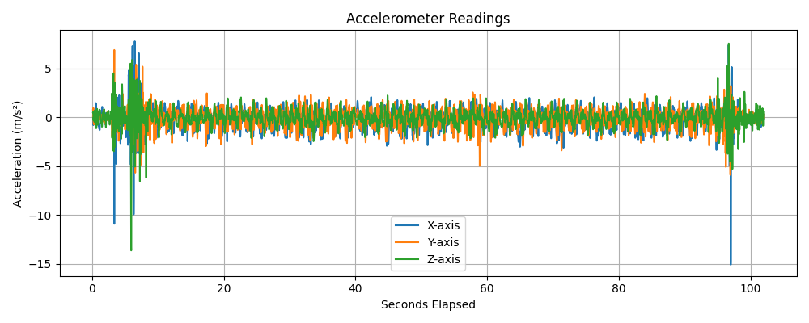
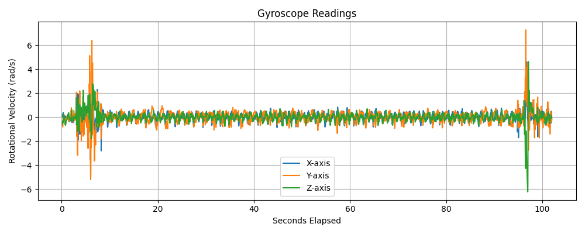
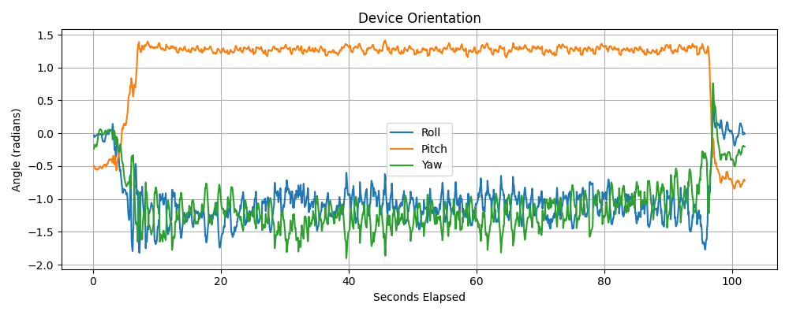
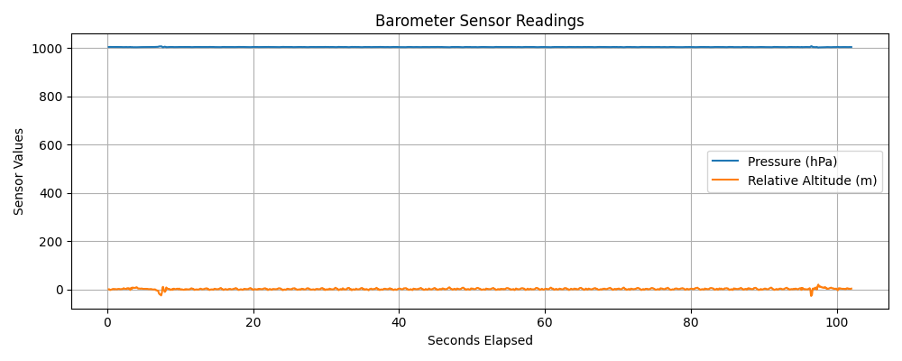
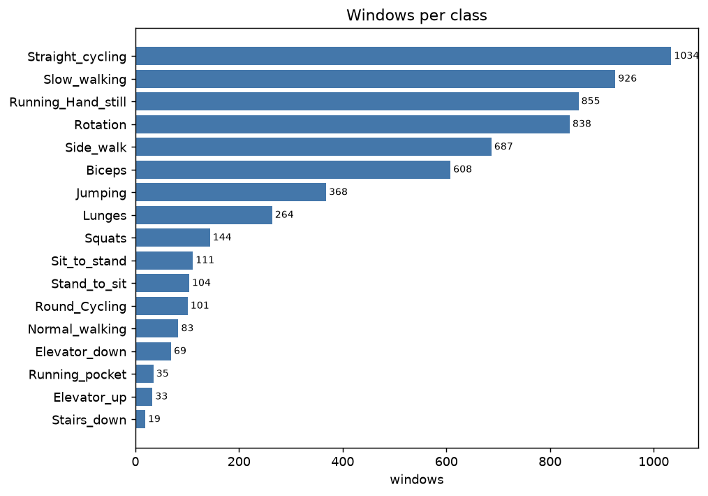
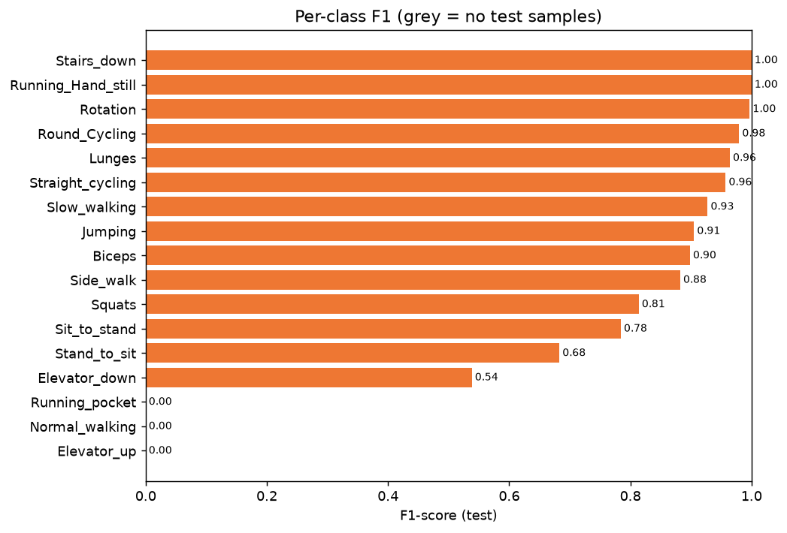
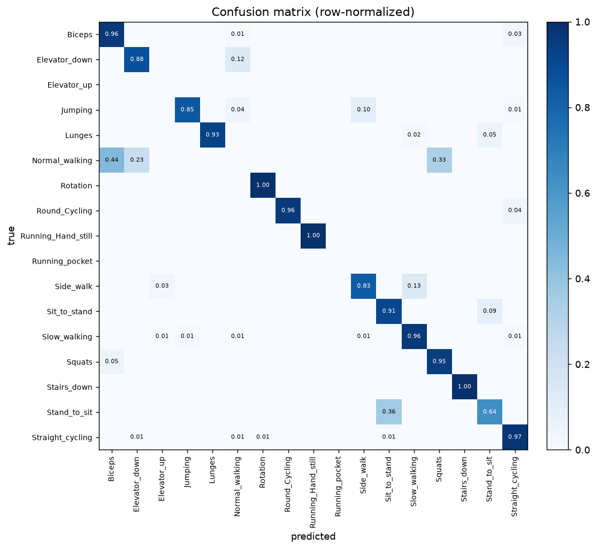
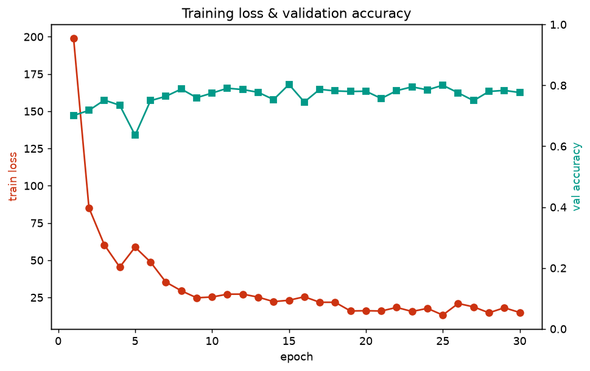

# Human Activity Recognition from Smartphone IMU

We classify short windows of phone-motion data into one of 17 everyday activities using a
CNN-LSTM. All data is recorded with the [phyphox](https://phyphox.org/) app on a Pixel 8a at
roughly 100 Hz, using six sensor streams: accelerometer, gyroscope, gravity, total
acceleration, orientation, and barometer.

The 17 activities are deliberately fine-grained:

> Biceps, Squats, Lunges, Jumping, Rotation, Sit→Stand, Stand→Sit, Slow walking,
> Normal walking, Side walking, Running (hand-held), Running (in pocket), Straight cycling,
> Round cycling, Stairs down, Elevator up, Elevator down.

CS655 (Wireless & Mobile Computing, GMU) — Sehaj Gill & Yukta Batra.

## The data we recorded

Each recording is a phyphox export: one CSV per sensor, each with its own timestamps. A short
clip of the raw streams looks like this.

**Accelerometer** — the main motion signal. The bursts at the start/end are picking the phone
up and putting it down; the steady middle is the activity itself.



**Gyroscope** — angular velocity, which separates rotational activities (Rotation, cycling)
from linear ones.



**Orientation** — the phone's attitude as a quaternion. We feed the raw quaternion
(`qw, qx, qy, qz`) to the model rather than Euler angles to avoid wrap-around discontinuities.



**Barometer** — pressure and relative altitude. The signal is almost flat second-to-second,
but the small altitude drift is what lets the model tell elevators and stairs apart. Note that
the Stairs_down recordings have no barometer stream, so those two columns are zero-filled for
that class.



## Setup

Requires [`uv`](https://docs.astral.sh/uv/) and Python 3.14.

```bash
uv venv --python 3.14 .venv
uv pip install --system-certs --python .venv/Scripts/python.exe -r requirements.txt
```

Run scripts as modules from the repo root (on the Windows console, prefix `PYTHONUTF8=1`):

```bash
.venv/Scripts/python.exe -m src.har.preprocess.ingest_zips     # 0. (one-off) import original zips
.venv/Scripts/python.exe -m src.har.preprocess.merge_sensors   # 1. align sensors
.venv/Scripts/python.exe -m src.har.preprocess.window_data     # 2. make windows
.venv/Scripts/python.exe -m src.har.train                      # 3. train + validate + test + plots
.venv/Scripts/python.exe -m src.har.predict                    # 4. predict test zips
```

Training writes all the evaluation figures used below to `docs/plots/`. It augments the data
on the fly (small sensor rotations, amplitude scaling, jitter, magnitude warp) to help the
under-sampled classes.

Optional extras:

```bash
.venv/Scripts/python.exe -m src.har.cross_validate          # k-fold CV: mean +/- std accuracy
.venv/Scripts/python.exe -m src.har.summarize recording.zip # narrates the activity timeline
```

`summarize` needs `ANTHROPIC_API_KEY` for the natural-language log (the raw timeline prints
without it). `predict` also takes a single zip or folder:
`... -m src.har.predict path/to/recording.zip`.

## How it works

1. **Merge** — per-sensor CSVs are joined on `seconds_elapsed` with a nearest-timestamp
   `merge_asof`; the slow streams (barometer, orientation, gravity) are forward/back-filled so
   they survive the join instead of becoming zeros.
2. **Window** — each recording is cut into 192-sample windows (≈1.9 s) with a 64-sample stride
   over the 18 explicit channels in `config.FEATURE_COLUMNS`. Every window remembers which
   recording it came from.
3. **Train** — we split by *recording*, not by window, fit normalization on the training set
   only (and save it), and use a class-weighted loss to push back on the imbalance.
4. **Predict** — a new zip is merged, windowed, normalized with the saved stats, and the
   per-window predictions are majority-voted into a single activity.

## Results

Everything below splits **by recording, never by window.** Because windows overlap (stride 64
< size 192), a naive per-window split puts near-duplicate windows on both sides and reports a
misleading ~0.97. Splitting whole recordings is the honest measure.

### How much data each class has

The dataset is heavily imbalanced — from ~1000 windows for Straight_cycling down to 19 for
Stairs_down. This single fact explains most of the results that follow.



### Cross-validation (the headline number)

5-fold `StratifiedGroupKFold` over the 120 recordings, 20 epochs/fold, augmentation on
(6279 windows total):

| Metric | Mean ± std |
|---|---|
| Accuracy | **0.814 ± 0.089** |
| Macro-F1 | **0.563 ± 0.088** |

Per-fold macro-F1 ranged 0.40–0.63. The variance is large because the thin classes rotate
through the test set each fold, so the luck of which recording lands where swings the macro
average. Full log: `docs/cv_5fold.log`.

### Single held-out split — per class

From one recording-level train/val/test split (`src.har.train`: 73 train / 22 val / 25 test
recordings, 1232 test windows). On this split the model reaches **accuracy 0.908, macro-F1
0.725, weighted-F1 0.899** — higher than the cross-validated figure above because a single
split doesn't average in the unluckiest folds. The per-class breakdown is where you see
exactly which activities work and which don't:

| Activity | F1 | Activity | F1 |
|---|---|---|---|
| Stairs_down | 1.00\* | Slow_walking | 0.93 |
| Running_Hand_still | 1.00 | Jumping | 0.91 |
| Rotation | 1.00 | Biceps | 0.90 |
| Round_Cycling | 0.98 | Side_walk | 0.88 |
| Lunges | 0.96 | Squats | 0.81 |
| Straight_cycling | 0.96 | Sit_to_stand | 0.78 |
| | | Stand_to_sit | 0.68 |
| | | Elevator_down | 0.54 |
| | | Normal_walking | 0.00 |
| | | Running_pocket | — (no test data) |
| | | Elevator_up | — (no test data) |

\* Stairs_down scores 1.00 on just 4 test windows (only 19 in the whole dataset), so treat it
as encouraging rather than proven.



### Confusion matrix



### Training curves

Training loss drops quickly and flattens; validation accuracy climbs into the ~0.78–0.80 band
and stays there (best checkpoint 0.803). No runaway overfitting — the model converges and the
best-validation checkpoint is the one that gets saved.



## What we learned

- **Strong, distinct activities are easy.** Rotation, Running (hand-held), cycling, Lunges,
  Slow_walking, Jumping, and Biceps all sit at 0.9+ F1. The CNN-LSTM clearly picks up their
  characteristic motion signatures.
- **The failures are a data problem, not a model problem.** Every 0.00 (Normal_walking,
  Running_pocket, Elevator_up) is a class with only 1–2 recordings. Running_pocket and
  Elevator_up have no test recording at all, and Normal_walking has one whose windows scatter
  across other classes — predicted as Biceps (44%), Slow_walking (33%), and Elevator_down
  (23%), never as itself. The model can't learn a class it has barely seen.
- **The mistakes the model *does* make are intuitive.** Stand_to_sit is confused with
  Sit_to_stand (36%) — they are time-reverses of the same motion. Elevator_down and
  Normal_walking bleed into each other (Elevator_down → Normal_walking 12%, the reverse 23%),
  and Side_walk leaks into Slow_walking (13%). These are genuinely similar movements, not
  random errors.
- **Accuracy (~0.91) sits above macro-F1 (~0.73)** because accuracy is dominated by the big
  classes the model nails, while macro-F1 averages every class equally and is dragged down by
  the starved ones. Across the more robust 5-fold CV the same gap is wider still
  (0.81 vs 0.56). Either way, the gap *is* the imbalance.
- **The honest evaluation matters.** An earlier version split by window and reported ~0.97.
  Splitting by recording dropped that to the numbers above — which are the ones worth trusting.

## Limitations

- Several classes have far too few recordings; three (Normal_walking, Running_pocket,
  Elevator_up) can't be honestly evaluated yet. More balanced recordings is the single biggest
  lever — more so than any change to the model.
- All data so far is from **one person on one phone**, so cross-user and cross-device
  generalization is unmeasured. The realistic fix is recording the same activities from more
  people and phone placements.

## Layout

```
data/
  raw/<Activity>/<Sample>/*.csv     per-sensor recordings (input)
  processed/merged/<Activity>/*.csv aligned per recording (generated)
  processed/windowed/*.npy          windows + labels + group ids (generated)
  test_zips/                        held-out recording zips for inference
  original_recordings/              original phyphox exports
src/har/
  config.py                         paths, feature list, hyperparameters
  preprocess/merge_sensors.py       timestamp-aligned sensor merge
  preprocess/window_data.py         sliding-window dataset builder
  models/cnn_lstm.py                CNN-LSTM model
  augment.py                        on-the-fly IMU augmentation (train only)
  train.py                          recording-level split, weighted loss, eval, plots
  predict.py                        zip -> activity inference
  cross_validate.py                 grouped k-fold cross-validation
  summarize.py                      activity-log narration layer (optional)
  viz.py                            plotting helpers
models/                             trained weights + norm_stats.npz
docs/                               report, slides, plots
archive/                            superseded / debug scripts (not used)
```
